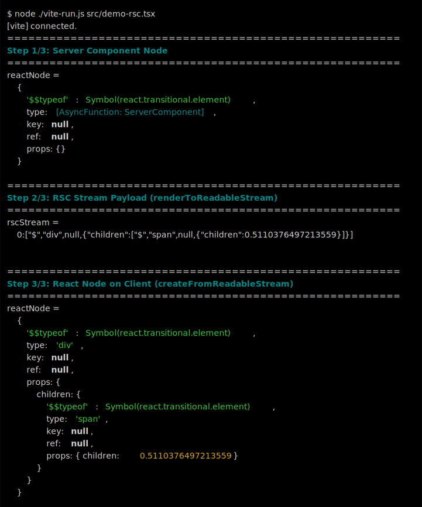
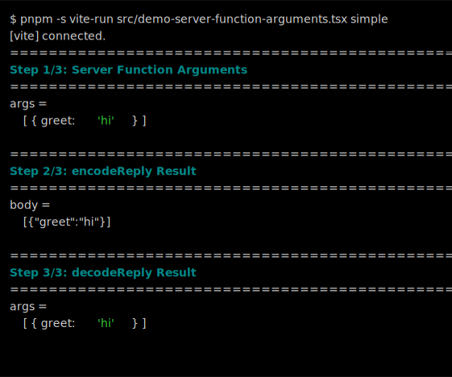
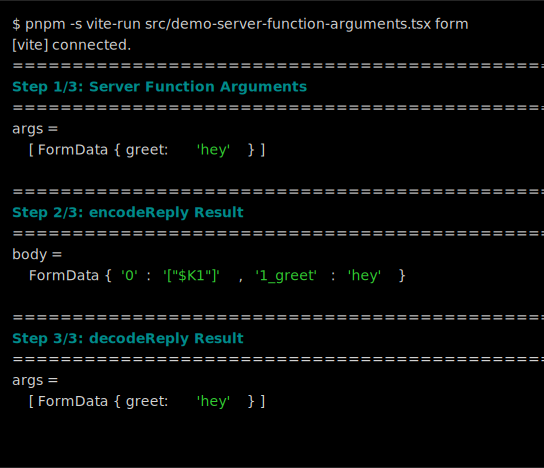
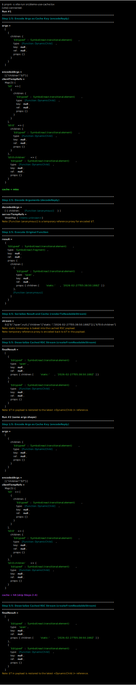

# React Tokyo Fes 2026 "use cache" poster demo

Runnable demo code from my poster session in https://react-tokyo.vercel.app/fes2026

## Run demos

- [Run on browser (Stackblitz)](https://stackblitz.com/edit/github-ivqdpjye?file=src%2Fdemo-use-cache.tsx)

### Demo 1.1

- Code: [src/demo-rsc.tsx](./src/demo-rsc.tsx)

```sh
node ./vite-run.js src/demo-rsc.tsx
```



### Demo 1.2 (simple)

- Code: [src/demo-server-function-arguments.tsx](./src/demo-server-function-arguments.tsx)

```sh
node ./vite-run.js src/demo-server-function-arguments.tsx simple
```



### Demo 1.2 (form)

- Code: [src/demo-server-function-arguments.tsx](./src/demo-server-function-arguments.tsx)

```sh
node ./vite-run.js src/demo-server-function-arguments.tsx form
```



### Demo 2.1

- Code: [src/demo-use-cache.tsx](./src/demo-use-cache.tsx)

```sh
node ./vite-run.js src/demo-use-cache.tsx
```


